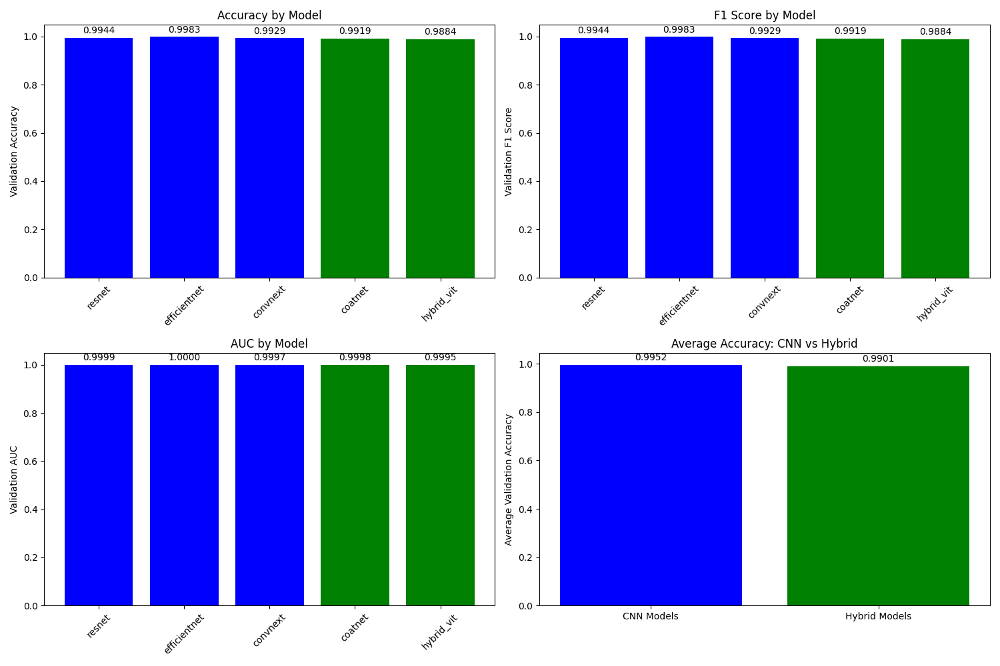

# AI vs Real Image Classification

This repository contains a comprehensive framework for classifying images as either AI-generated or real photographs using state-of-the-art deep learning models.

<p align="center">
  
</p>

## 🔍 Project Overview

This project implements and compares multiple deep learning architectures to distinguish between AI-generated images and real photographs. The system provides high-accuracy classification, visualization tools, and a user-friendly Streamlit interface for real-time predictions.

## 🧠 Models

The framework includes five state-of-the-art models:

- **ResNet-50**: A classic deep architecture with residual connections
- **EfficientNet-B4**: Optimized for both accuracy and computational efficiency
- **ConvNeXt**: A modern convolutional architecture with transformer-inspired design
- **CoAtNet**: A hybrid model combining convolution and self-attention mechanisms
- **Hybrid ViT**: A Vision Transformer with convolutional backbone for image classification

Each model is trained with identical settings and compared on multiple metrics. For each model, we save four checkpoints:

- `best_acc.pth`: Best validation accuracy
- `best_f1.pth`: Best F1 score
- `best_auc.pth`: Best AUC score
- `final.pth`: Final model after training

## 🚀 Getting Started

### Prerequisites

- Python 3.8+
- PyTorch 1.10+
- torchvision
- pandas
- numpy
- scikit-learn
- matplotlib
- tqdm
- streamlit (for web app)

### Installation

```bash
# Clone the repository
git clone https://github.com/garg-tejas/ai-vs-real.git
cd ai-vs-real

# Install dependencies
pip install -r requirements.txt
```

### Training

Train a single model:

```bash
python main.py --model resnet --batch_size 32 --epochs 30 --lr 0.001
```

Train all models:

```bash
python main.py --model all --batch_size 32 --epochs 30 --lr 0.001
```

### Inference

Generate predictions on test data with a single model:

```bash
python infer.py --model resnet --test_csv test.csv --model_dir checkpoints
```

Generate predictions using all models:

```bash
python infer.py --model all --test_csv test.csv --model_dir checkpoints
```

### Visualization

Visualize model performance:

```bash
python visualize_results.py
```

## 🖥️ Streamlit Web Application

The project includes a Streamlit web application for real-time image classification using all five models.

### Running Locally

```bash
streamlit run app.py
```

### Deploying to Streamlit Cloud

1. Fork/clone this repository to your GitHub account
2. Upload your models to Hugging Face Hub (see below)
3. Update the `HF_REPO_ID` in `app.py` with your Hugging Face username
4. Deploy on [Streamlit Cloud](https://share.streamlit.io) by connecting to your GitHub repository

## 📂 Project Structure

```
ai-vs-real/
├── app.py                  # Streamlit web application
├── infer.py                # Inference script for generating predictions
├── main.py                 # Main training script
├── packages.txt            # System dependencies for Streamlit Cloud
├── requirements.txt        # Python dependencies
├── upload_models_to_hf.py  # Script to upload models to Hugging Face
├── visualize_results.py    # Tools for visualizing model performance
├── models/                 # Model architecture implementations
│   ├── resnet_model.py
│   ├── efficientnet_model.py
│   ├── convnext_model.py
│   ├── coatnet_model.py
│   └── hybrid_vit_model.py
├── utils/                  # Helper functions
│   ├── dataloader.py       # Data loading utilities
│   └── train_eval.py       # Training and evaluation functions
├── logs/                   # Training logs
├── plots/                  # Generated visualization plots
├── submissions/            # Prediction submissions
└── streamlit_model/        # Saved model checkpoints
```

## 📊 Evaluation Metrics

The framework evaluates models using:

- Accuracy
- F1 Score
- Precision & Recall
- ROC-AUC
- Confusion Matrix
- Inference Time
- Parameter Count
